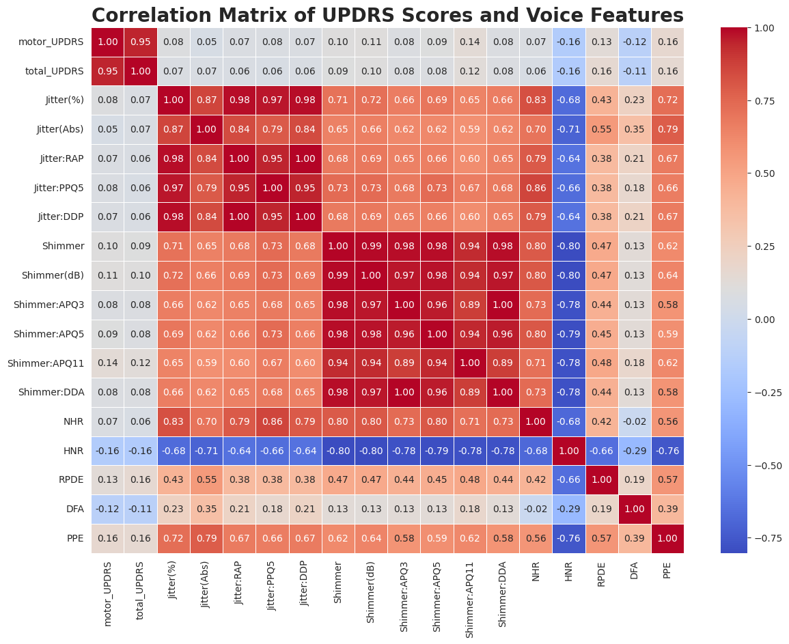

# 🧠 EDA PROJECT 3
# Mapping Parkinson's Journey: An Exploratory Analysis of Telemonitoring Data

---

## 📘 About the Project

This project undertakes an Exploratory Data Analysis (EDA) of a Parkinson's disease telemonitoring dataset. The dataset comprises biomedical voice measurements collected from individuals with early-stage Parkinson's disease during a six-month clinical trial utilizing a telemonitoring device. The primary objective of this EDA is to gain a comprehensive understanding of the dataset's structure, the characteristics of vocal features and clinical scores (UPDRS), and to explore the relationships and trends within the data over time. The insights gained will shed light on the variability of Parkinson's disease progression and the potential of telemonitoring data, particularly voice features, as indicators of disease severity and progression.

---

## 🧰 Tools & Libraries

* **Python (Jupyter Notebook)**
* **pandas** and **numpy** for data wrangling
* **matplotlib** and **seaborn** for visualization
* **scipy** and **statsmodels** for basic statistical analysis

---

## 🔍 Key Exploratory Questions Addressed

1. **Are there specific vocal characteristics that are associated with the severity of Parkinson's disease symptoms?**
2. **Which voice features show the strongest linear relationship with motor and total UPDRS scores?**
3. **Do any of the voice features appear to be potential indicators or predictors of Parkinson's disease severity?**
4. **How do motor and total UPDRS scores change over time for individual subjects?**
5. **Do key voice features show a discernible trend (increase or decrease) over time within individual subjects?**
6. **Is there significant variability in the rate of UPDRS score change or voice feature change across different subjects?**
7. **How do demographic factors (age, sex) relate to the baseline UPDRS scores or the rate of progression over time?**
8. **Is there a relationship between the initial severity of Parkinson's disease (e.g., baseline UPDRS score) and the rate at which UPDRS scores or voice features change over time?**
9. **Are there differences in the distribution of motor and total UPDRS scores between male and female subjects?**
10.**Are there differences in the distribution of key voice features between male and female subjects?**

---

## 📊 Findings and Concluding Remarks

* The dataset contains **5875 observations** and **22 features**, primarily numeric, representing continuous voice-based measurements.
* Significant correlations were found between **frequency and amplitude-based voice features** and both **motor_UPDRS** and **total_UPDRS** scores.
* Outlier analysis revealed a few anomalous **test_time** readings that may stem from data recording inconsistencies.
* Patterns suggest that **voice signal features** could act as non-invasive indicators for disease monitoring.
* The exploratory phase confirms strong potential for building predictive regression models to forecast disease severity based on vocal biomarkers.

---

## 📸 Sample Visuals

| UPDRS Score Distribution                             | Correlation Heatmap                        | Voice Feature Trends                     | Outlier Detection                |
| ---------------------------------------------------- | ------------------------------------------ | ---------------------------------------- | -------------------------------- |
|  |  |  |  |

*(Save these plots from your notebook as `.png` files and upload them into the `images/` folder in this repo.)*

---

## 📁 Repository Structure

```
eda3_parkinsons_disease_telemonitoring/
│── notebooks/
│   └── EDA_Project3_Parkinsons.ipynb
│── images/
│   ├── updrs_distribution.png
│   ├── heatmap.png
│   ├── voice_trends.png
│   └── outliers.png
│── README.md
```

---

## 📂 Dataset Access

Due to data licensing restrictions, the dataset is not uploaded to this repository.
You can access it here:
👉 [Oxford Parkinson’s Disease Telemonitoring Dataset](https://www.kaggle.com/datasets/dankok/oxford-parkinsons-disease-telemonitoring-dataset)

---

## 🚀 Next Steps

* Apply **feature selection** and correlation filtering
* Develop **predictive regression models** for UPDRS estimation
* Explore **time-series modeling** of progression per patient
* Visualize longitudinal patterns in **vocal biomarkers**

---

## ✍️ Author

**Adebayo Fashina**
📍 Toronto, Canada | [LinkedIn](https://www.linkedin.com/in/your-link-here)
